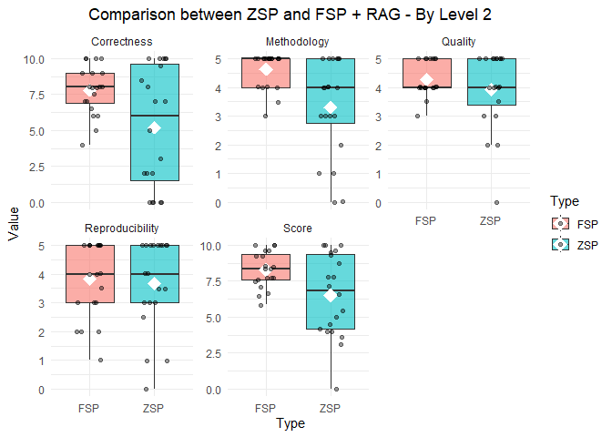
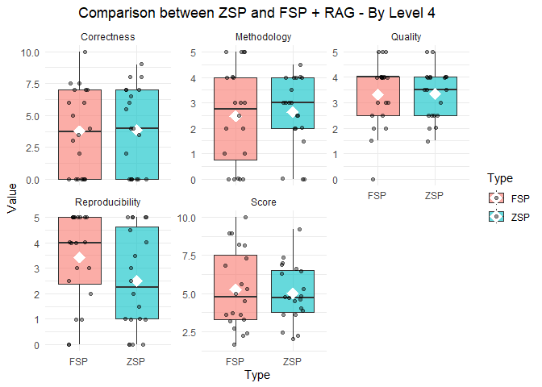

# Analyse Comparative : ZSP vs FSP + RAG

## 1. Chargement et préparation des données

``` r
df <- read_csv2(".\\LLM_Benchmarks.csv")
```

## 2. Tests de normalité (Shapiro-Wilk)

``` r
shapiro_results <- sapply(c("Exactitude", "Methodologie", "Reproductibilite", "Qualite",
 "Score"), function(metric) {
  zsp <- df[[paste0(metric, "_ZSP")]]
  fsp <- df[[paste0(metric, "_FSP_RAG")]]
  p_zsp <- shapiro.test(zsp)$p.value
  p_fsp <- shapiro.test(fsp)$p.value
  c(ZSP = p_zsp, FSP_RAG = p_fsp)
})
t(shapiro_results)
```

```
##                           ZSP      FSP_RAG
## Exactitude       4.631465e-07 1.545151e-08
## Methodologie     1.475666e-07 2.484478e-11
## Reproductibilite 8.794292e-09 1.350029e-10
## Qualite          3.531027e-08 6.085396e-09
## Score            1.567592e-03 1.538406e-07
```

## 3. Tests d'hypothèse (t-test ou Wilcoxon apparié)

``` r
test_results <- lapply(c("Exactitude", "Methodologie", "Reproductibilite", "Qualite",
 "Score"), function(metric) {
  zsp <- df[[paste0(metric, "_ZSP")]]
  fsp <- df[[paste0(metric, "_FSP_RAG")]]
  if (shapiro.test(zsp)$p.value > 0.05 && shapiro.test(fsp)$p.value > 0.05) {
    test <- t.test(zsp, fsp, paired = TRUE, alternative = "less")
  } else {
    test <- wilcox.test(zsp, fsp, paired = TRUE, alternative = "less")
  }
  data.frame(Metric = metric, p_value = test$p.value, statistic = test$statistic)
})
do.call(rbind, test_results)
```

```
##              Metric     p_value statistic
## V        Exactitude 0.016523477     696.5
## V1     Methodologie 0.016999021     458.0
## V2 Reproductibilite 0.026197329     497.0
## V3          Qualite 0.443124374     673.0
## V4            Score 0.004494911     986.5
```

• H0 (p-value >= 0.05) : Les scores moyens avec ZSP sont supérieurs ou égaux à ceux avec FSP+RAG.

• H1 (p-value < 0.05) : Les scores moyens avec ZSP sont inférieurs à ceux avec FSP+RAG (donc FSP+RAG est supérieur).

## 4. Visualisation : Boxplots comparatifs

``` r
df_long <- df %>%
  select(Exactitude_ZSP, Exactitude_FSP_RAG,
         Methodologie_ZSP, Methodologie_FSP_RAG,
         Reproductibilite_ZSP, Reproductibilite_FSP_RAG,
         Qualite_ZSP, Qualite_FSP_RAG,
         Score_ZSP, Score_FSP_RAG) %>%
  pivot_longer(cols = everything(),
               names_to = c("Metric", "Type"),
               names_sep = "_",
               values_to = "Value")

ggplot(df_long, aes(x = Type, y = Value, fill = Type)) +
  geom_boxplot(alpha = 0.6, outlier.shape = NA) +
  geom_jitter(width = 0.2, alpha = 0.4) +
  facet_wrap(~ Metric, scales = "free_y") +
  theme_minimal() +
  theme(plot.title = element_text(hjust = 0.5)) +
  labs(title = "Comparaison des scores entre ZSP et FSP + RAG - Global")
```

<!-- -->

## 5. Analyse par Niveau

``` r
# Regroupement par niveau et calcul de la moyenne par métrique
df$Level <- df$Level_ZSP
df_by_level <- df %>%
  group_by(Level) %>%
  summarise(across(ends_with("ZSP"), mean, na.rm = TRUE),
            across(ends_with("FSP_RAG"), mean, na.rm = TRUE))

# Transformation des données pour la visualisation
niveaux <- sort(unique(df$Level))

get_tests_by_level <- function(niveau) {
  sous_df <- df %>% filter(Level == niveau)
  results <- lapply(c("Exactitude", "Methodologie", "Reproductibilite", "Qualite",
   "Score"), function(metric) {
    zsp <- sous_df[[paste0(metric, "_ZSP")]]
    fsp <- sous_df[[paste0(metric, "_FSP_RAG")]]
    if (length(zsp) > 2 && shapiro.test(zsp)$p.value > 0.05 && shapiro.test(fsp)$p.value > 0.05) {
      test <- t.test(zsp, fsp, paired = TRUE, alternative = "less")
    } else {
      test <- wilcox.test(zsp, fsp, paired = TRUE, alternative = "less")
    }
    data.frame(Metric = metric, p_value = test$p.value, statistic = test$statistic)
  })
  do.call(rbind, results)
}

tests_par_niveau <- lapply(niveaux, get_tests_by_level)
names(tests_par_niveau) <- paste("Niveau", niveaux)

tests_par_niveau
```

```
## $`Niveau 1`
##              Metric     p_value statistic
## V        Exactitude 0.005695738      12.0
## V1     Methodologie 0.029648780      10.0
## V2 Reproductibilite 0.018399684       7.0
## V3          Qualite 0.150401371       7.5
## V4            Score 0.004925565      21.5
## 
## $`Niveau 2`
##              Metric     p_value statistic
## V        Exactitude 0.015565517 30.500000
## V1     Methodologie 0.001912898  9.500000
## V2 Reproductibilite 0.417427485 63.500000
## V3          Qualite 0.124106539 34.000000
## t             Score 0.005952462 -2.781041
## 
## $`Niveau 3`
##              Metric   p_value statistic
## V        Exactitude 0.4137206      80.0
## V1     Methodologie 0.5000000      38.5
## V2 Reproductibilite 0.4896625      67.0
## V3          Qualite 0.9057033     103.5
## V4            Score 0.4347439     100.0
## 
## $`Niveau 4`
##              Metric    p_value  statistic
## V        Exactitude 0.57474540 55.0000000
## V1     Methodologie 0.63372787 65.5000000
## V2 Reproductibilite 0.03397186 12.0000000
## V3          Qualite 0.52519565 53.0000000
## t             Score 0.33596402 -0.4301471
```
• H0 (p-value >= 0.05) : Les scores moyens avec ZSP sont supérieurs ou égaux à ceux avec FSP+RAG.

• H1 (p-value < 0.05) : Les scores moyens avec ZSP sont inférieurs à ceux avec FSP+RAG (donc FSP+RAG est supérieur).

## 6. Visualisations séparées par Niveau

``` r
for (niveau in niveaux) {
  sous_df <- df %>%
    filter(Level == niveau) %>%
    select(Exactitude_ZSP, Exactitude_FSP_RAG,
           Methodologie_ZSP, Methodologie_FSP_RAG,
           Reproductibilite_ZSP, Reproductibilite_FSP_RAG,
           Qualite_ZSP, Qualite_FSP_RAG,
           Score_ZSP, Score_FSP_RAG) %>%
    pivot_longer(cols = everything(),
                 names_to = c("Metric", "Type"),
                 names_sep = "_",
                 values_to = "Value")
  
  print(
    ggplot(sous_df, aes(x = Type, y = Value, fill = Type)) +
      geom_boxplot(alpha = 0.6, outlier.shape = NA) +
      geom_jitter(width = 0.2, alpha = 0.4) +
      facet_wrap(~ Metric, scales = "free_y") +
      theme_minimal() +
      theme(plot.title = element_text(hjust = 0.5)) +
      labs(title = paste("Comparaison ZSP vs FSP + RAG - Niveau", niveau))
  )
}
```

<!-- --><!-- --><!-- --><!-- -->
